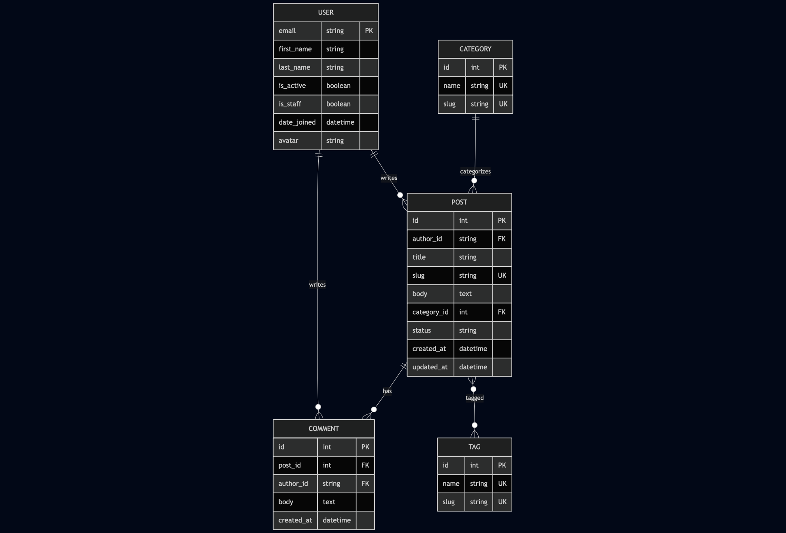

## Homework 4 — nginx reverse proxy

### Architecture

Browser / curl  →  nginx (host :80)  →  web / Daphne (internal web:8000)
                          │
                          ├── /static/ → static_files volume (read-only)
                          └── /media/  → media_files  volume (read-only)
- nginx is the only service published to the host on port 80.
- The web container exposes 8000 only on the internal Compose network.
- Static and media files are served by nginx directly off the named volumes Django writes to (`static_files` is populated by collectstatic in scripts/entrypoint.sh; media_files by Django uploads).
- /ws/... is proxied with Upgrade / Connection headers so the hw3 WebSocket route keeps working.

### 1. Start

docker compose up --build
Wait for the web container to print Listening on TCP address 0.0.0.0:8000.

### 2. Admin through nginx

curl -I http://localhost/admin/login/
Expect: HTTP/1.1 200 OK (or 302 redirect) and a Server: nginx/... response header.

### 3. Static files through nginx

curl -I http://localhost/static/admin/css/base.css
Expect: HTTP/1.1 200 OK, Server: nginx/..., and a Cache-Control: max-age=... / Expires: header (set via expires 7d in `nginx/default.conf`).

### 4. API through nginx

curl http://localhost/api/posts/
Expect: a valid JSON response (paginated post list or {"detail": "..."} for an empty/auth-gated case — both prove the proxy reaches Django).

### 5. nginx returns 502 when web is stopped

docker compose stop web
curl -I http://localhost/api/posts/
Expect: HTTP/1.1 502 Bad Gateway served by nginx.

Restore:

docker compose start web
### 6. web is not reachable directly from the host

curl http://localhost:8000/
Expect: Failed to connect / Connection refused. The web service uses expose: ["8000"] only — no host port mapping.

### 7. WebSocket through nginx

Get a JWT first:

curl -s -X POST http://localhost/api/auth/token/ \
     -H 'Content-Type: application/json' \
     -d '{"email":"<user>","password":"<pass>"}'
Connect (requires wscat or `websocat`):

wscat -c "ws://localhost/ws/posts/<existing-slug>/comments/?token=<jwt>"
Expect: HTTP/1.1 101 Switching Protocols on the upgrade and an open WS session. Then, in another terminal, post a comment through the REST API:

curl -X POST http://localhost/api/posts/<existing-slug>/comments/ \
     -H "Authorization: Bearer <jwt>" \
     -H 'Content-Type: application/json' \
     -d '{"body":"hello over ws"}'
The new comment payload should arrive on the open WebSocket within a second.